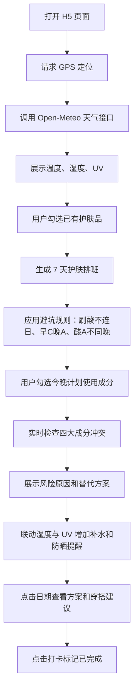

## 1. 产品概述
「高颜值护肤成分与穿搭日历」是面向熬夜、久坐、长期吹空调的 IT 人群的移动端 H5 单页应用。
- 解决护肤成分冲突、刷酸过度、天气变化下防晒和补水提醒不及时的问题。
- 以日系极简和莫兰迪配色呈现一周护肤排班、实时天气联动、成分避坑检查和办公室/外出穿搭建议。

## 2. 核心功能

### 2.1 功能模块
1. **首页仪表盘**：当前日期、城市/位置状态、温度、湿度、UV 指数、天气状态。
2. **产品勾选区**：支持勾选 LuLuLun 基础保湿/修护面膜、含烟酰胺修护面膜、The Ordinary 水杨酸/果酸、维 C、视黄醇、高效防晒。
3. **智能 7 天日历**：自动生成早间/晚间护肤方案，展示补水、防晒、修护、刷酸等标签。
4. **成分避坑检查区**：用户勾选今晚计划使用的成分/护肤品后，实时检测四大冲突并给出替代方案。
5. **天气联动提醒**：使用 HTML5 Geolocation 获取定位，并调用 Open-Meteo 免费接口获取实时温度、湿度、UV 指数。
6. **穿搭建议**：根据温度和湿度给出适合久坐办公室及外出的日系穿搭建议。
7. **打卡交互**：点击日历某天展开详情；点击打卡按钮后任务变灰并显示已完成。

### 2.2 页面详情
| 页面名称 | 模块名称 | 功能说明 |
| --- | --- | --- |
| H5 单页 | 天气顶部栏 | 展示日期、城市/定位状态、温湿度、UV；定位失败时使用默认天气并给出提示 |
| H5 单页 | UV 横幅 | 当 UV 指数大于等于 3 时显示醒目防晒提醒 |
| H5 单页 | 产品勾选区 | 用户勾选已有护肤品后实时重算 7 天方案 |
| H5 单页 | 成分避坑检查区 | 勾选今晚要用的成分后实时检测冲突，展示风险原因和替代方案 |
| H5 单页 | 7 天日历看板 | 展示每日主题、重点标签、早研/晚护摘要 |
| H5 单页 | 展开详情面板 | 显示当天早间方案、晚间方案、成分避坑说明和穿搭建议 |
| H5 单页 | 打卡按钮 | 将当天护肤任务标记为已完成，视觉变灰 |

## 3. 核心流程
用户打开页面后，应用请求定位并获取天气数据；用户勾选自己拥有的护肤品；系统根据护肤成分避坑规则、湿度和 UV 指数生成一周日历；用户可在成分避坑检查区勾选今晚计划使用的产品，系统实时提示冲突、原因和替代方案；用户点击某天查看详情并完成打卡。

## 4. 用户界面设计

### 4.1 设计风格
- 色彩：莫兰迪米杏、鼠尾草绿、雾粉、灰蓝、暖灰，局部使用低饱和珊瑚红强调风险。
- 风格：日系极简、柔和留白、纸感卡片、细边框、轻阴影。
- 字体：通过 CDN 使用适合日系生活方式页面的衬线标题字体与清爽无衬线正文字体；保留本地字体兜底。
- 按钮：大圆角胶囊按钮，轻微按压反馈，适合拇指触控。
- 动效：首屏卡片渐入、日历卡点击展开、冲突提示柔和出现、打卡状态平滑过渡。

### 4.2 页面设计概览
| 页面名称 | 模块名称 | UI 元素 |
| --- | --- | --- |
| H5 单页 | 顶部仪表盘 | 日期、城市、天气状态、温湿度、UV 指数，半透明纸感卡片 |
| H5 单页 | 防晒横幅 | 条带式醒目提醒，低饱和橙红背景 |
| H5 单页 | 产品勾选区 | 分组胶囊复选项，选中状态为鼠尾草绿 |
| H5 单页 | 成分避坑检查区 | 雾粉/米杏卡片，冲突时显示柔和红色边框、风险文案和替代方案 |
| H5 单页 | 7 天日历 | 竖向手机卡片列表，含星期、日期、主题、标签 |
| H5 单页 | 详情面板 | 早研/晚护/穿搭三块内容，展开后显示 |

### 4.3 响应式
采用移动端优先设计，适配 360px 到 480px 常见手机宽度；在桌面浏览器中居中显示手机宽度容器。所有可点击区域不小于 44px，支持触屏操作。

### 4.4 护肤排班规则
- 刷酸不连日：安排 The Ordinary 强效酸类的次日自动设为温和修护/保湿日。
- 早 C 晚 A：拥有维 C 时早间推荐维 C 防护；拥有视黄醇时晚间推荐视黄醇抗衰。
- 酸类与视黄醇不可同晚：刷酸夜停用维 A，晚间改为保湿或修护面膜。
- UV 大于等于 3：显示防晒横幅，提醒使用 ALLIE 级别高效防晒并物理遮阳。
- 湿度低于 50%：当晚追加“加强补水”标签，推荐高效保湿面膜。
- 温度穿搭：25 度以上推荐透气 T 恤和轻薄长裤；15-24 度推荐衬衫/卫衣加薄外套；低于 15 度推荐保暖叠穿。
- 高湿穿搭：湿度较高时追加透气速干面料提醒。

### 4.5 成分冲突动态检查规则
- 高浓度酸 + 视黄醇：提示刺激性叠加，易发红脱皮；建议今晚仅局部刷酸并搭配温和保湿修护，将 A 醇移至明晚。
- 高浓度酸 + 烟酰胺：提示低 pH 酸类可能增加烟酰胺转化为烟酸的风险，易刺痛发红；建议酸类与含烟酰胺密集修护面膜分日使用。
- 视黄醇 + 高浓度维 C：提示活性 pH 不同且刺激性叠加；建议早间使用维 C，晚间单独使用 A 醇或改为修护。
- 水杨酸 + 果酸：提示多酸叠加会过度剥脱角质；建议只保留一种酸类，另一种移至间隔 2-3 天后的夜间。
- 当无冲突时：展示温和绿色状态，提示当前组合更适合熬夜和久坐空调环境下的屏障维护。
