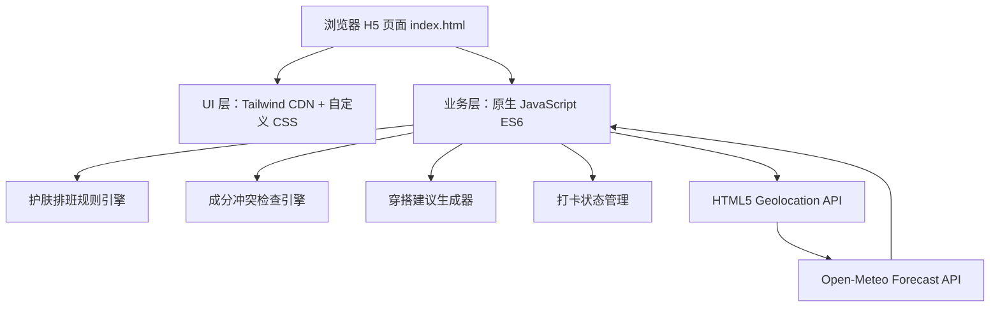

## 1. 架构设计
本项目采用纯前端单文件架构，所有结构、样式和业务逻辑写入 `index.html`。页面可直接双击打开，天气能力通过浏览器定位和 Open-Meteo 公共接口完成。



## 2. 技术说明
- 前端：HTML5 + Tailwind CSS CDN + 原生 JavaScript ES6。
- 后端：无。
- 数据库：无。
- 本地状态：使用内存状态保存当前勾选、今晚成分选择、展开日期和本次会话打卡状态；不强依赖 LocalStorage，保证双击打开即可运行。
- 外部服务：Open-Meteo Forecast API，用经纬度获取 `temperature_2m`、`relative_humidity_2m`、`uv_index`、`weather_code`。
- 定位能力：HTML5 Geolocation API。定位被拒绝或接口失败时，使用默认天气兜底，并在界面显示状态说明。

## 3. 路由定义
| 路由 | 用途 |
| --- | --- |
| 本地 `index.html` | 单页应用，包含完整护肤日历、天气联动、成分冲突检查、穿搭推荐和打卡交互 |

## 4. API 定义
无自建后端 API。外部天气接口如下：

```text
GET https://api.open-meteo.com/v1/forecast
  ?latitude={latitude}
  &longitude={longitude}
  &current=temperature_2m,relative_humidity_2m,uv_index,weather_code
  &timezone=auto
```

响应字段使用：
| 字段 | 类型 | 用途 |
| --- | --- | --- |
| `current.temperature_2m` | number | 当前温度 |
| `current.relative_humidity_2m` | number | 当前湿度 |
| `current.uv_index` | number | 当前 UV 指数 |
| `current.weather_code` | number | 转换为天气文案 |

## 5. 前端模块划分
| 模块 | 责任 |
| --- | --- |
| `state` | 保存产品勾选、今晚成分选择、天气、日历、选中日期、打卡状态 |
| `fetchWeather()` | 请求定位与天气接口，失败时设置默认天气 |
| `generateSchedule()` | 根据产品勾选和天气生成 7 天护肤方案 |
| `buildDayPlan()` | 为单日生成早间方案、晚间方案、标签和避坑说明 |
| `checkIngredientConflicts()` | 根据今晚勾选组合实时返回冲突列表、风险原因和替代方案 |
| `getOutfitAdvice()` | 根据温度和湿度生成穿搭建议 |
| `render()` | 渲染顶部天气、产品勾选、成分检查、日历、详情和打卡状态 |
| `bindEvents()` | 处理勾选、冲突检查、日期展开、打卡等交互 |

## 6. 核心算法
1. 以当前日期为起点生成连续 7 天。
2. 如果用户拥有 The Ordinary 酸类，默认每周安排 2 个刷酸夜，间隔至少 2 天，例如第 2 天和第 5 天。
3. 刷酸夜晚间方案优先级最高：酸类精华 + 保湿修护，明确停用视黄醇。
4. 刷酸日次日强制设为修护日：推荐 LuLuLun 修护/保湿面膜，不安排酸类和视黄醇。
5. 非刷酸、非修护日：若拥有视黄醇，晚间安排视黄醇；否则安排保湿修护。
6. 早间：若拥有维 C，推荐维 C；若拥有高效防晒，早间追加 ALLIE 级别防晒；UV 大于等于 3 时强化防晒提醒。
7. 湿度低于 50%：所有当天晚间方案追加“加强补水”标签和高效保湿面膜建议。

## 7. 成分冲突检查算法
1. 将今晚勾选项抽象为成分键：`salicylic_acid`、`aha`、`retinol`、`niacinamide`、`vitamin_c`、`repair_mask`。
2. 使用规则表逐条检测组合。规则包含 `pair`、`title`、`reason`、`suggestion`、`severity`。
3. 命中任意规则时，界面展示“危险搭配”提示、冲突成分、风险原因和替代方案。
4. 多条冲突可同时展示，例如水杨酸 + 果酸 + A 醇会命中“多酸叠加”和“酸 + 视黄醇”。
5. 无冲突时展示安全状态，并推荐保湿修护作为熬夜/久坐空调环境下的兜底方案。

## 8. 兼容性与降级
- 页面依赖 Tailwind CDN 和字体 CDN；网络不可用时，自定义 CSS 与本地字体兜底仍保持可用布局。
- Geolocation 需用户授权；拒绝授权时不阻塞核心功能。
- Open-Meteo 请求失败时使用默认天气数据，保证护肤排班、成分检查和穿搭建议可继续生成。
